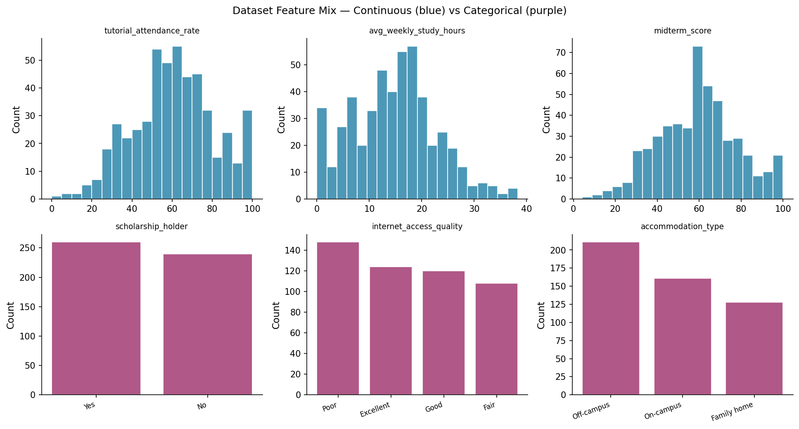
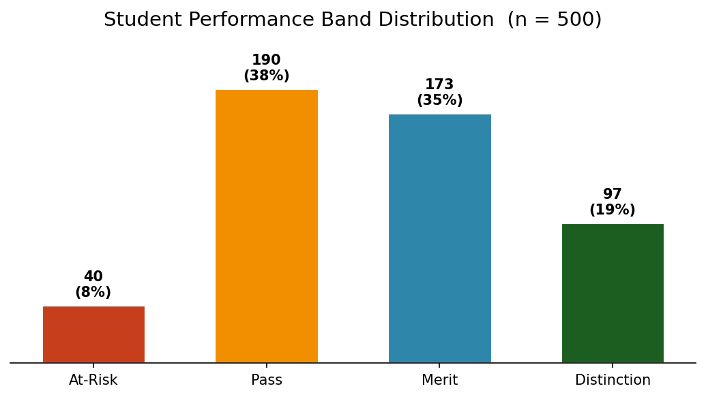
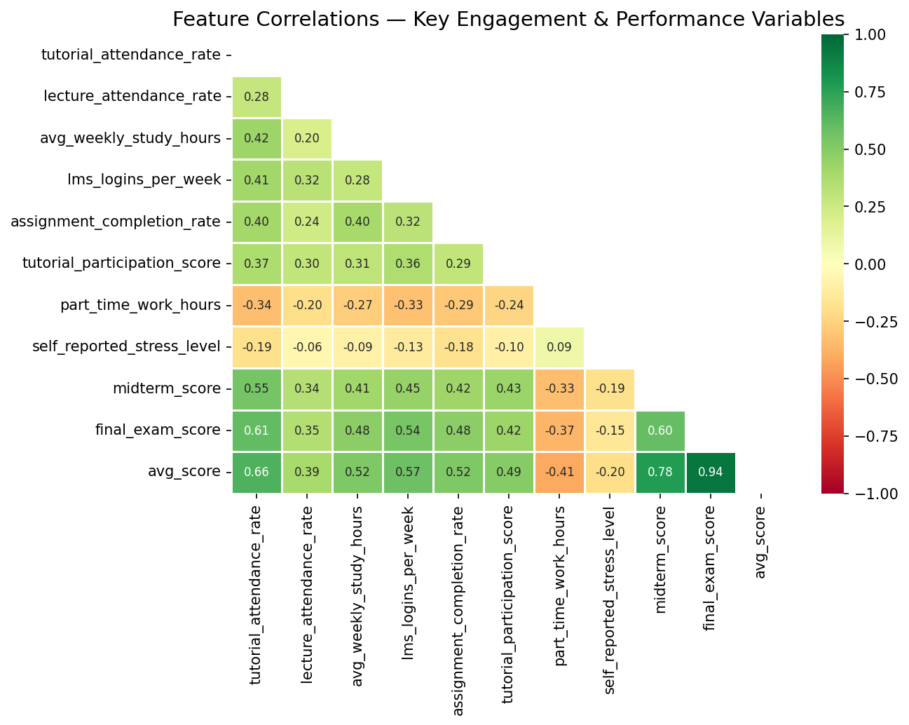
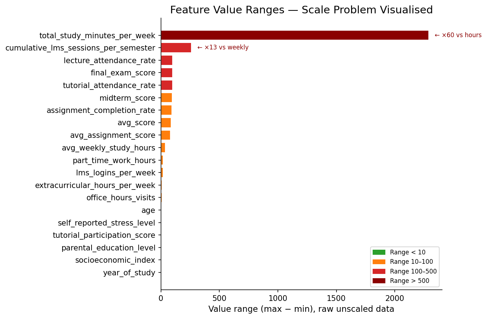
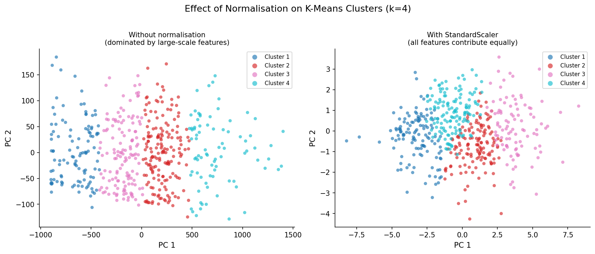

<!-- _class: title -->

# Workshop 2
## Machine Learning for Education Research
### HCA · K-Means · Random Forest

<br>

**National Institute of Education, Singapore**
Quantitative Data Analysis · Jupyter + ipywidgets

---

## Agenda

<div class="cols">
<div>

**Part 1 — The Dataset**
- 500 synthetic student profiles
- Mixed continuous + categorical features
- Why data preparation matters

**Part 2 — Unsupervised Learning**
- Hierarchical Clustering (HCA)
- K-Means Clustering
- Interpreting student archetypes

</div>
<div>

**Part 3 — Supervised Learning**
- Random Forest Classification
- Predicting performance bands
- Feature importance & interpretation

**Part 4 — Hands-On**
- Interactive Jupyter notebooks
- No code editing required
- Bring your own CSV

</div>
</div>

> Each notebook runs top-to-bottom. All hyperparameters are controlled via widgets — point, click, explore.

---

<!-- _class: section -->

# Part 1
## The Dataset

---

## Student Learning Profiles Dataset

**500 synthetic students · 29 features · reproducible (seed 42)**

<div class="cols">
<div>

| Category | Features |
|---|---|
| Demographics | age, gender, faculty, year |
| Socioeconomic | SES index, parental education |
| Scholarships | scholarship holder, accommodation |
| Engagement | attendance rates, LMS logins |
| Study habits | hours, participation, office hours |
| Assessment | midterm, final, assignments |
| Lifestyle | stress, part-time work, activities |
| **Target** | **performance\_band** |

</div>
<div>

**Why synthetic?**

Real student data carries significant privacy obligations. A synthetic dataset lets us:

- Control the ground truth
- Build in realistic correlations
- Safely share and reproduce results
- Focus on the *methods*, not data cleaning

A **latent ability variable** drives correlated features so the patterns are plausible, not random noise.

</div>
</div>

---

## A Deliberate Mix of Data Types

<div class="img-full">



</div>

> **Blue = continuous** (histogram) · **Purple = categorical** (bar chart) · All notebooks handle both types — the preprocessing widget encodes categoricals automatically.

---

## Performance Band Distribution

<div class="cols">
<div class="img-center">



</div>
<div>

**Bands are derived from `avg_score`:**

| Band | Score | Count |
|---|---|---|
| **At-Risk** | < 40 | 40 (8%) |
| **Pass** | 40 – 59 | 190 (38%) |
| **Merit** | 60 – 74 | 173 (35%) |
| **Distinction** | ≥ 75 | 97 (19%) |

The slight class imbalance (At-Risk is rare) mirrors real institutional data and motivates the `class_weight='balanced'` option in the Random Forest notebook.

</div>
</div>

---

## Feature Correlations

<div class="img-center">



</div>

> `tutorial_attendance_rate` correlates more strongly with final scores than `lecture_attendance_rate` — a key finding we will rediscover with Random Forest.

---

## The Scale Problem

<div class="img-full">



</div>

---

## Why Scale Matters

Two pairs of columns encode **identical behaviour** at very different magnitudes:

| Column | Range | Paired with | Scale gap |
|---|---|---|---|
| `avg_weekly_study_hours` | 0 – 40 | `total_study_minutes_per_week` | — |
| `total_study_minutes_per_week` | 0 – 2,400 | ↑ same info, minutes not hours | **×60** |
| `lms_logins_per_week` | 0 – 20 | `cumulative_lms_sessions_per_semester` | — |
| `cumulative_lms_sessions_per_semester` | 0 – 300 | ↑ same info, semester total | **×13** |

<div class="warn">

⚠ Without **StandardScaler**, K-Means and HCA distance calculations are dominated almost entirely by `total_study_minutes_per_week`. The algorithm ignores everything else.

</div>

This is deliberate — the workshop lets you **see** this effect interactively.

---

<!-- _class: section -->

# Part 2
## Unsupervised Learning
### HCA & K-Means

---

## Hierarchical Clustering Analysis (HCA)

<div class="cols">
<div>

**How it works:**

1. Start: every student is their own cluster
2. Find the two closest clusters and **merge** them
3. Repeat until one cluster remains
4. Record merge distances → **dendrogram**

**Linkage methods:**

| Method | Merges clusters by… |
|---|---|
| Ward | Minimising within-cluster variance |
| Complete | Maximum pairwise distance |
| Average | Mean pairwise distance |
| Single | Minimum pairwise distance |

</div>
<div>

**Why use it?**

- No need to specify *k* in advance
- Deterministic — same input → same result
- Dendrogram reveals *hierarchy* of similarity
- Good for exploratory analysis

**Best for:**
> *"We don't know how many student archetypes exist — let the data tell us."*

</div>
</div>

---

## Reading a Dendrogram

<div class="img-full">


</div>

> The **red dashed line** is the cut threshold. Each vertical line it crosses = one cluster. The **height** of a merge = how different those groups were. A large gap before a merge suggests the clusters below are genuinely distinct.

---

## K-Means Clustering

<div class="cols">
<div>

**Algorithm:**

1. Place *k* **centroids** (k-means++ init)
2. Assign each student to nearest centroid
3. Move each centroid to the **mean** of its group
4. Repeat until stable

**Key parameters:**

| Parameter | Effect |
|---|---|
| `k` | Number of clusters |
| `init` | k-means++ reduces bad starts |
| `n_init` | Run *n* times, keep best |
| `max_iter` | Convergence limit |

</div>
<div>

**Vs HCA:**

| | HCA | K-Means |
|---|---|---|
| Specify *k*? | No | Yes |
| Deterministic? | Yes | No (use seed) |
| Scales to large *n*? | Slow | Fast |
| Cluster shapes | Any | Spherical |
| Output | Dendrogram | Hard labels |

**Best for:**
> *"HCA suggested 4 archetypes — let's formalise them with K-Means and compare."*

</div>
</div>

---

## Choosing k — Elbow Method & Silhouette Score

<div class="img-full">


</div>

> **Elbow:** look for the bend where adding more clusters gives diminishing returns. **Silhouette:** higher = more separated clusters. Both suggest **k = 4** here.

---

## Effect of Normalisation on Clustering

<div class="img-full">



</div>

> **Left:** without scaling, clusters split almost entirely on `total_study_minutes_per_week` — every other feature is irrelevant. **Right:** with StandardScaler, clusters reflect the full range of student behaviour.

---

## K-Means Clusters vs Performance Bands

<div class="img-full">


</div>

> The unsupervised clusters (left) roughly align with performance bands (right) **without ever seeing the labels** — validating the cluster structure. This is a sanity check, not ground truth.

---

<!-- _class: section -->

# Part 3
## Supervised Learning
### Random Forest Classification

---

## Random Forest Classification

<div class="cols">
<div>

**Building blocks:**

A single **decision tree** splits data on feature thresholds to predict a label.

A **random forest:**
- Trains *N* trees on **random subsets** of data (bagging)
- Each split considers only a **random subset** of features
- Final prediction = **majority vote**

**Why ensemble?**
Each tree overfits slightly to its subset. Averaging many noisy trees → low bias **and** low variance.

</div>
<div>

**Key parameters:**

| Parameter | Typical range |
|---|---|
| `n_estimators` | 100–500 |
| `max_depth` | 5–15 (or None) |
| `min_samples_leaf` | 1–10 |
| `max_features` | sqrt (*default*) |
| `class_weight` | balanced (for skewed classes) |

**Overfitting check:**
> If train accuracy >> test accuracy (gap > 15%), reduce `max_depth` or increase `min_samples_leaf`.

</div>
</div>

---

## Feature Importance

<div class="img-full">


</div>

> `tutorial_attendance_rate` **(red)** is substantially more important than `lecture_attendance_rate` **(orange)** — consistent with the correlation structure built into the dataset, and with prior education research.

---

## Model Performance

<div class="cols">
<div class="img-center">


</div>
<div>

**Reading the matrix:**
- Rows = **actual** band
- Columns = **predicted** band
- Diagonal = correct predictions
- Off-diagonal = errors

**Where does the model struggle?**

Adjacent bands are easiest to confuse — a Pass/Merit boundary error is less serious than an At-Risk/Distinction error.

**Discussion:**
> If this model were deployed to flag at-risk students, what are the ethical implications of false negatives?

</div>
</div>

---

## Data Leakage — A Caution

`avg_score` is a **derived column**: `0.2 × midterm + 0.5 × final + 0.3 × avg_assignment`

The `performance_band` target is also derived from `avg_score`.

<div class="warn">

⚠ **Including `avg_score` as a feature inflates accuracy dramatically.** The model is not learning student behaviour — it is learning the formula. This is called **data leakage**.

</div>

**In the notebook:**
- A leakage detector flags this automatically
- A checkbox lets you remove `avg_score` before training
- **Try both** — observe the accuracy difference

> Real institutional data often contains derived or post-hoc columns. Always ask: *"Would this feature be available at the time of prediction?"*

---

<!-- _class: section -->

# Part 4
## Hands-On Workshop

---

## Workshop Flow

```
Notebook 1 — HCA          Notebook 2 — K-Means       Notebook 3 — Random Forest
─────────────────────      ─────────────────────      ──────────────────────────
Load CSV                   Load same CSV              Load CSV + select label
  ↓                          ↓                          ↓
Preprocess                 Preprocess (scale req.)    Preprocess + split
  ↓                          ↓                          ↓
[Step 2b]                  [Step 2b]                  Leakage check
Scale check                Normalisation demo           ↓
  ↓                          ↓                        Train RF
Ward linkage               Elbow + silhouette           ↓
Dendrogram                 Train K-Means              Feature importance
  ↓                          ↓                          ↓
Cluster profiles           Compare clusters           Confusion matrix
  ↓                          ↓                          ↓
Interpretation             Compare to HCA             Reflection
```

---

## Using Your Own Data

All three notebooks are **dataset-agnostic**.

<div class="cols3">
<div class="box">

**1. Load**
Enter your CSV path or drag-and-drop upload. Any CSV works.

</div>
<div class="box">

**2. Map columns**
Select feature columns and (for RF) your label column from dropdowns.

</div>
<div class="box">

**3. Preprocess**
Choose scaling and encoding. The widget handles the rest.

</div>
</div>

**Column mapping tips:**
- For clustering: select numeric or ordinal columns — avoid ID columns
- For classification: the label should be a categorical column (grade band, group)
- Categorical features are encoded automatically (Label Encode or One-Hot)
- Missing values are filled with 0 after encoding

> **The code never references a column by name** — all choices come from your widget selections.

---

## Summary — Key Takeaways

<div class="cols">
<div>

**Methods covered:**

| Method | Type | Key insight |
|---|---|---|
| HCA | Unsupervised | Discovers structure without labels |
| K-Means | Unsupervised | Formalises clusters efficiently |
| Random Forest | Supervised | Predicts labels with interpretability |

**Preprocessing matters:**
- Scaling is **required** for distance-based methods
- Encoding is **required** for categorical features
- Leakage detection is **required** for honest evaluation

</div>
<div>

**Questions to carry forward:**

1. Do your clusters match your intuition about student groups?
2. Is tutorial attendance really more predictive than lecture attendance in your data?
3. What features would you add to improve the model?
4. What ethical constraints apply when ML is used to classify students?

**The goal is not accuracy** — it is **understanding your data** through a computational lens.

</div>
</div>

---

<!-- _class: title -->

# Thank You

**Workshop materials:** `workshop-2/` in the repository

```
jupyter lab notebooks/
```

**Questions? Bring your own CSV and let's explore together.**

<br>

*Built with Python · scikit-learn · ipywidgets · Jupyter*
