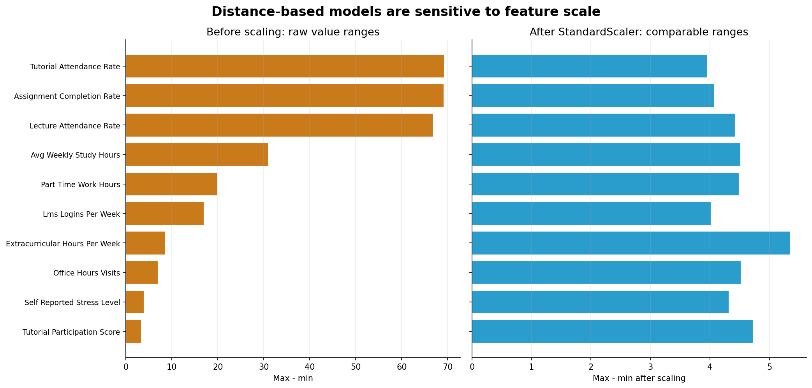
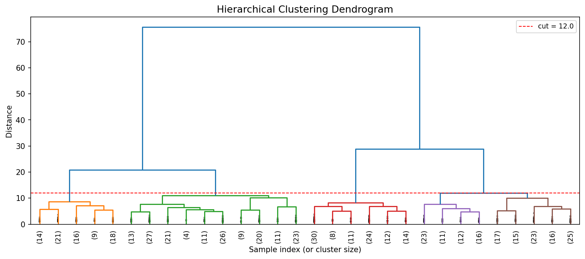
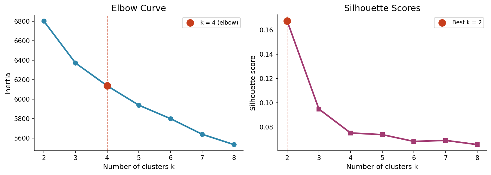
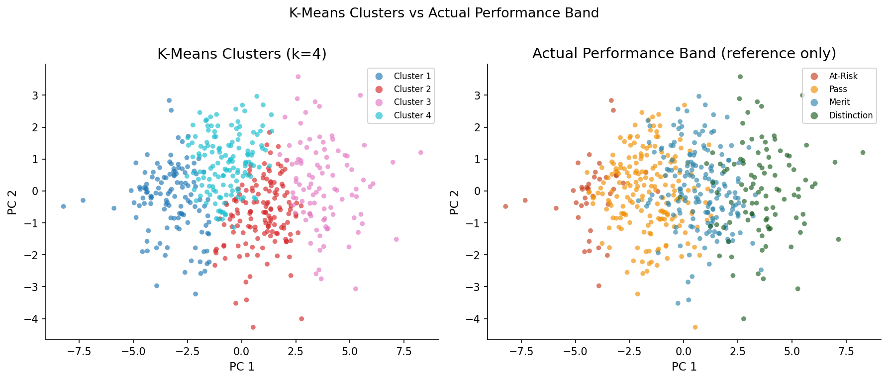
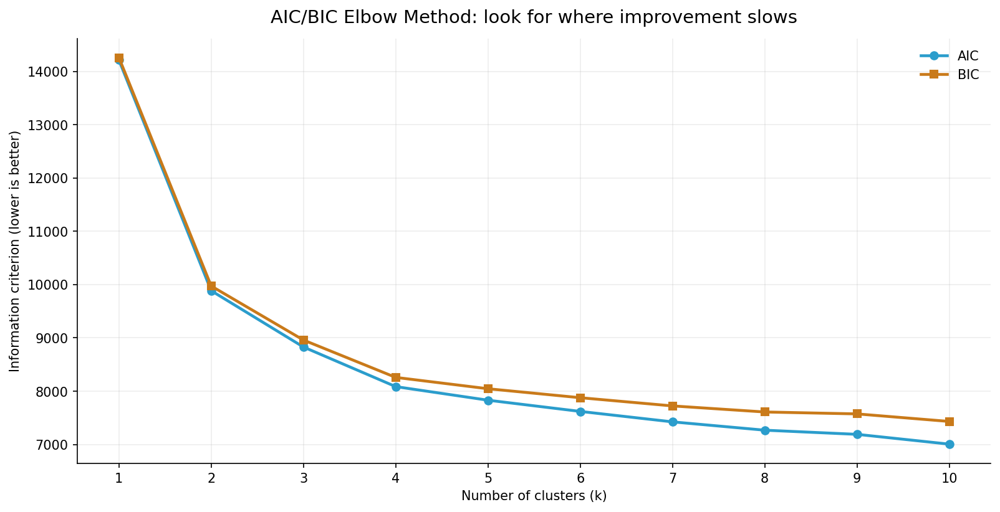
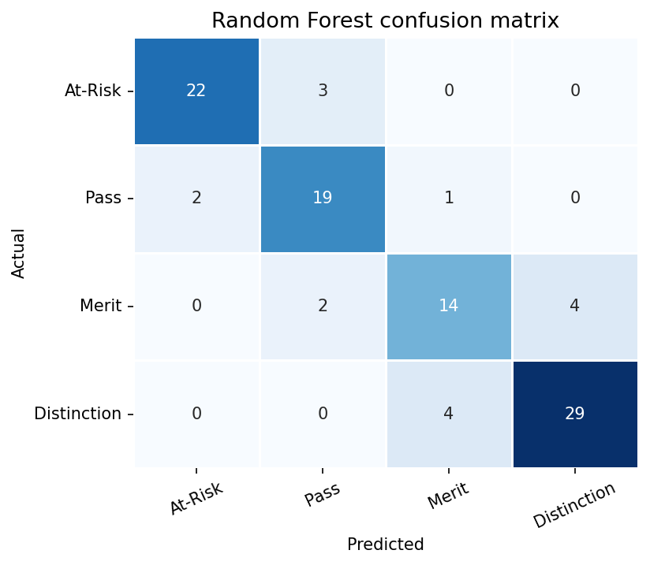
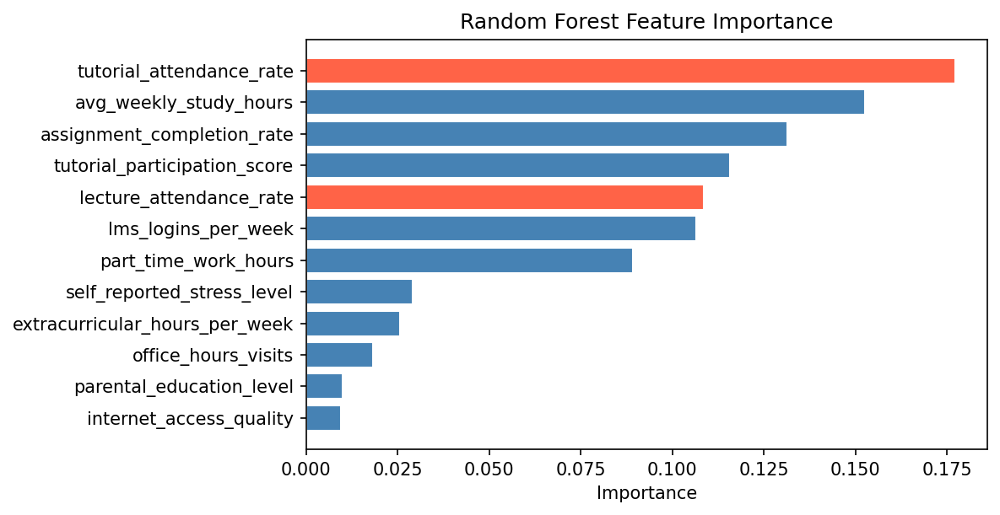

<!-- _class: title -->

# Hands-On Machine Learning Workshop: From Data to Insights

## OfR Professional Development Series

 
 
 

**Wednesday, 06 May 2026** 
**1.00 pm - 3.30 pm** 
**Link to the Slides: https://tinyurl.com/ml-workshop-slides**

---

## Agenda

Today's workshop has two main themes, **concepts** and **implementations**. We will:
1. Understand the core concepts and techniques behind supervised and unsupervised learning.
2. Learn how to use Jupyter Notebooks and Python to implement these concepts.
3. Understand how to interpret results
4. Gain an intuition and the materials for how to analyze your own datasets. 

**Pre-requisites: Google Account for Google Colab / Local Python Environment**

---

## Bring Your Own Dataset

The materials from this workshop are designed to be re-used for your own datasets. If you have your own data you would like to explore, feel free to try using it here.

We have also generated a synthetic dataset of student performance data for today's exercises. It contains 500 rows and 29 columns covering:

| Column Group | Column Names |
|---|---|
| Demographics and context | `year_of_study`, `faculty`, `scholarship_holder`, `internet_access_quality` |
| Engagement | `lecture_attendance_rate`, `tutorial_attendance_rate`, `lms_logins_per_week` |
| Study and workload | `avg_weekly_study_hours`, `part_time_work_hours`, `self_reported_stress_level` |
| Assessment scores | `avg_assignment_score`, `midterm_score`, `final_exam_score`, `avg_score` |
| Target/outcome | `performance_band` |

The default clustering notebooks use behaviour and workload columns. The Random Forest notebook also includes selected context columns and leaves score columns for leakage review.

---

## Exercise 1: Exploratory Data Analysis

Before making any decisions on how to proceed with a dataset, we must first get an overall understanding of it.

We can use the following Python libraries for this:
1. [Pandas](https://pandas.pydata.org/docs/user_guide/index.html) for data loading and manipulation
2. [Matplotlib](https://matplotlib.org/stable/users/index.html) for data visualization

Notebook Link: https://tinyurl.com/ml-workshop-notebook-0

---

## Dataset Pre-Processing

| Column type | Example | Typical question | Possible action |
|---|---|---|---|
| Numeric | `avg_weekly_study_hours` | Are the scales comparable? | Scale or normalise |
| Categorical | `faculty` | Can the model read labels? | Encode or exclude |
| Identifier | `student_id` | Does it describe behaviour? | Usually remove |
| Missing values | blank attendance values | Are blanks meaningful or accidental? | Fill, remove, or revisit |
| Target/outcome | `performance_band` | Is this what we are predicting? | Exclude from training data |

---

## Categorical Encoding

Models need numbers, so categorical columns can be label encoded, one-hot encoded, or dropped.

- **Label encoding:** replace each category with a number, such as `Low = 0`, `Medium = 1`, `High = 2`.
- **One-hot encoding:** create one 0/1 column per category, such as `faculty_Engineering` or `faculty_Business`.
- **Dropping:** remove a categorical column when it is not useful, has too many messy categories, or would add noise.

---

## Scaling

HCA and K-Means compare rows by measuring distance between feature values.

Scaling puts features onto a comparable range so the model pays attention to patterns across all selected columns.

---

## Two Paradigms of Machine Learning

### Unsupervised Learning

I only see inputs, so I have to figure out the structure myself.

> "Do these features naturally group together?"

### Supervised learning

I see both inputs and outputs, so I learn to map one to the other.

> "Can we predict this label?"

---

<!-- _class: section -->

# Unsupervised Learning
## HCA and K-Means Clustering

---

## HCA: Introduction

Hierarchical Clustering Analysis is a bottom-up algorithm that starts by treating every row as its own cluster. It repeatedly joins the closest rows or groups until everything is connected.

**Use HCA when:**
- the dataset is not too large
- you do not know how many groups to expect

**Account for:**
- features having different scales
- branches not being clearly separated

---

## HCA Output: Dendrogram

Key Intuition: Reading the graph bottom-up

---

## HCA: Jupyter Notebook Walkthrough

**Notebook 1**
- load the dataset
- choose feature columns
- apply preprocessing
- run HCA
- inspect the dendrogram and cluster profiles

Notebook Link: https://tinyurl.com/ml-workshop-notebook-1

---

## K-Means: Introduction

K-Means is a clustering algorithm that assigns every row to one of `k` clusters. It places centroids, assigns rows to the nearest centroid, moves the centroids, and repeats until the assignments settle.

**Use K-Means when:**
- you want a fixed number of groups
- the dataset is larger
- you want to assign every row to one cluster

**Account for:**
- having to choose `k` before running the model
- features having different scales

---

## K-Means Output: Elbow Plot and Cluster Comparison

Key Intuition:

- The elbow plot helps choose an appropriate number of clusters
- The cluster comparison helps us check whether the groups are interpretable.

---

## K-Means Model Selection: AIC/BIC Elbow

- lower score is better
- fit improves as `k` increases
- extra clusters are penalised
- BIC is more conservative than AIC

Choose a `k` near the elbow where adding more clusters gives diminishing returns.

---

## K-Means: Jupyter Notebook Walkthrough

**Notebook 2**
- load the dataset
- choose feature columns
- apply required scaling
- inspect the elbow plot
- choose `k`
- compare cluster profiles

Notebook Link: https://tinyurl.com/ml-workshop-notebook-2

---

<!-- _class: section -->

# Supervised Learning
## Random Forest Classification

---

## Random Forest: Introduction

A decision tree segments data based on yes/no questions. A Random Forest builds many trees and lets them vote on the outcome.

**Use Random Forest when:**
- you have a known label to predict
- you want a strong baseline model
- you want to inspect which features the model used

**Account for:**
- overfitting
- class imbalance

---

## Random Forest Output: Confusion Matrix and Feature Importance

---

## Random Forest: Jupyter Notebook Walkthrough

**Notebook 3**
- select `performance_band` as the label
- choose feature columns
- train the Random Forest
- inspect the confusion matrix
- compare feature importance
- test what happens when leakage is introduced

Notebook Link: https://tinyurl.com/ml-workshop-notebook-3

---

<!-- _class: section -->

# Part 4
## Extending this to your own data

---

## Using Jupyter Notebooks for Machine Learning

The notebooks are designed to be re-used with your own CSV files.

**Good notebook habits**
- duplicate notebooks before major experiments
- use clear names like `hca_mydata_v1.ipynb`
- code / markdown comments are useful for tracking changes

**Useful references**
- [Jupyter documentation](https://docs.jupyter.org/)
- [pandas getting started](https://pandas.pydata.org/docs/getting_started/index.html)
- [scikit-learn preprocessing](https://scikit-learn.org/stable/modules/preprocessing.html)
- [scikit-learn train/test split](https://scikit-learn.org/stable/modules/generated/sklearn.model_selection.train_test_split.html)
- [scikit-learn clustering](https://scikit-learn.org/stable/modules/clustering.html)
- [scikit-learn model evaluation](https://scikit-learn.org/stable/modules/model_evaluation.html)

---

## Conclusion

Today we:

- prepared data by encoding categories and scaling numeric features
- explored when to use unsupervised or supervised learning techniques
- used HCA to explore possible groupings
- used K-Means to create and compare clusters
- used Random Forest to predict a known outcome and inspect influential features
- discussed how to adapt the notebooks for your own datasets
